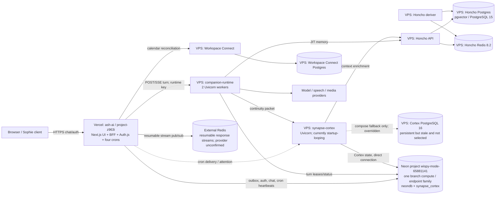

# Companion platform runtime — production handoff

**Status:** production source-of-truth map, updated 2026-09-20. The deployment
inventory and Neon incident analysis below were collected read-only; no service,
deployment, database, schedule or configuration was changed or restarted.

This is the entry point for agents changing Sophie or the shared companion
platform. Behavioral archives are evidence; deployed code is implementation
truth.

## Repository ownership

| Repository / deployment | Owns | Does not own |
|---|---|---|
| `ash-ai` / `llm-agent-test` on Vercel | UI, auth, canonical chats/messages, chronology, entry context, cross-chat operational state, voice transport, runtime streaming/persistence, Cortex outbox | Production conversational-agency decisions or Python foreground prompt |
| `companion-runtime` on VPS | Turn policy, Dual Aperture, capability/gear routing, tenure/release, prompt compilation, provider calls, beats, LIVE SITUATION, provenance, `next_session_state` | Canonical messages, auth, durable continuity extraction |
| `synapse-cortex` on VPS | Expectations, open loops, suppressions/resolutions, deadlines, recurring intentions and bounded continuity packets | Canonical chronology, foreground generation, conversational authority |
| Honcho | Semantic messages, observations, conclusions and retrieval | Routing, prompt authority, lifecycle state |

`ash-ai/main` triggers Vercel production. `companion-runtime/main` is pulled and
rebuilt at `/home/deploy/companion-runtime`. Synapse-Cortex deploys separately.
Never assume pushing one repository deploys another.

## Production deployment and infrastructure audit — 2026-09-20

### Finding in one paragraph

The September Neon allowance was consumed by an always-awake access pattern,
not by interactive Sophie volume and not primarily by an idle connection pool.
The Vercel production deployment invokes three cron routes every minute and a
fourth hourly. All four call `withWorkerHeartbeat`, which writes to the app
database before and after the job even when there is no useful work. The three
minute jobs therefore reset Neon's five-minute scale-to-zero window indefinitely.
This conclusion is independently supported by the usage arithmetic: from
2026-09-01 00:00 UTC to the first quota error at 2026-09-19 08:35:15 UTC is
440.5875 hours; a continuously active 0.25-CU compute would consume 110.1469
CU-hours, effectively the observed 110.09 CU-hours. The same Neon branch compute
serves the app database (`neondb`), Companion Runtime lease table, and Cortex
database (`synapse_cortex`), so the app crons kept Cortex's compute awake too.

### Audit boundary and evidence quality

- VPS state was observed at host `vmi2953493` (`161.97.150.246`) around
  2026-09-20 00:39 CEST using container inspection, health state, compose files,
  repository state, proxy configuration and retained logs.
- Vercel project metadata, current production deployment, environment-variable
  names, Marketplace storage metadata and retained function logs were read from
  the linked production project.
- Code paths were traced in all four checked-out repositories and matched to the
  deployed commits/images where possible.
- The Neon data-plane error and endpoint identity were observed directly through
  application/container logs and deployed connection strings. Direct Neon
  console SSO was unavailable during the audit, so the exact control-plane value
  of the scale-to-zero setting and Neon's full connection-history chart remain
  **unverified**. The documented default is five minutes and the usage pattern
  proves the compute did not reach an idle window whether that default or a
  longer enabled window was configured.
- Vercel's returned log set showed one complete cadence-shaped window: 1,440
  invocations each for the three minute jobs and 24 for the hourly job. Git
  history establishes when each schedule entered the production source; proxy
  logs extend Cortex-call evidence back to 2026-08-20. This is not a claim that
  Neon retained query-level history for the whole month.

### Architecture

The Nginx reverse proxy on the VPS publishes Companion Runtime at
`wa-ai.skillstap.com`, Cortex under `/synapse-cortex/`, and Workspace Connect
under `/workspace-connect/`. Internal Runtime → Cortex/Honcho traffic uses the
shared Docker network `stack_backend`; Honcho's database and Redis remain on its
private `honcho` network.

### Deployed service inventory

| Service | Where and how it starts | Source observed in production | Health check | Persistent connections / pool |
|---|---|---|---|---|
| Sophie UI + BFF + Auth + Vercel workers | Vercel project `project-z963i`; production branch `main`; Vercel builds/starts Next.js functions | GitHub `mukeshkumar108/ash-ai`, production commit `66d227d308017fe85c222c105036eada8efe0a19` | Platform/function health; no bespoke DB health route was found | Module-level `postgres.js` clients survive within warm function instances. Main client uses library default; specialist clients cap pools at 2–5. Activity, not merely pool residency, is the keep-awake mechanism. |
| Companion Runtime | VPS container `companion-runtime`; Compose `/home/deploy/companion-runtime/deploy/docker-compose.vps.yml`; `uvicorn`, two workers; `restart: unless-stopped` | `mukeshkumar108/companion-runtime`, commit `02f28fb0f0b3efc32986891a5ddf877b8ff87501`; image `companion-runtime:local` / `sha256:4c87…181d` | `GET /health` every 15s. It validates process/config only and does not query Neon, Cortex or Honcho. | No long-lived Postgres client pool. `psycopg.AsyncConnection.connect()` is opened per state-store operation and closed. During an active turn only, its lease heartbeat renews every 15s. |
| Synapse-Cortex API | VPS container `synapse-cortex`; Compose `/home/deploy/synapse-cortex/deploy/docker-compose.vps.yml`; `uvicorn src.main:app --host 0.0.0.0 --port 8010`; `restart: unless-stopped` | `mukeshkumar108/synapse-cortex`, deployed commit `c12a33518475a25fd47708bd805a2cc2a54d26c2`; image `deploy-api` / `sha256:8673…8faf` | `GET /health` every 10s; handler does not query Postgres. Startup does query Postgres and therefore fails before health can pass while quota-blocked. | SQLAlchemy async engine uses its normal persistent pool; no custom size/recycle settings. A quiet open pool is not supported by evidence as the continuous wake source. Cortex work does query Neon when requested or sweeping. |
| Cortex local Postgres | VPS `postgres:16-alpine`, named volume `deploy_synapse_cortex_pgdata`; required by Compose and health-gated before API start | Official image `sha256:4327…9e2` | `pg_isready` every 5s; local only | Persistent local server. It is **not selected** because `SYNAPSE_CORTEX_DATABASE_URL` overrides the fallback. It contains a stale populated copy, last writes observed 2026-08-29. |
| Honcho API | VPS `honcho-api`; entrypoint runs `scripts/provision_db.py`, then `fastapi run src/main.py`; `restart: unless-stopped` | Upstream `plastic-labs/honcho`, commit `d191c107e5250cc2ca4c6058d9ebfe26b7cfc6f8`; locally built image `sha256:2f90…3483` | `GET /health` every 5s; does not query its database | SQLAlchemy pool: size 10, overflow 20, pre-ping, 300s recycle, LIFO. It points only to local Honcho Postgres, never Neon. |
| Honcho deriver | VPS `honcho-deriver`; `python -m src.deriver`; `restart: unless-stopped` | Same Honcho commit; image `sha256:2e87…249e` | No Docker health check | Long-running worker; local Honcho Postgres pool and local Redis cache only. |
| Honcho Postgres | VPS `pgvector/pgvector:pg15`, `max_connections=200`, named volume `honcho-pgdata` | Official image `sha256:a20a…cc62` | Local `pg_isready` every 5s | Persistent local database; not a Neon consumer. |
| Honcho Redis | VPS `redis:8.2`, named volume `honcho-redis-data` | Official image `sha256:2f74…25edc1` | Local `PING` every 5s | Persistent local cache; not a Neon consumer. Honcho's durable work queue is database-backed, not Redis-backed. |
| Workspace Connect | VPS container behind `/workspace-connect/`; its own Compose stack | Separate deployed service; repository identity was not established in this audit | HTTP health every 10s; local Postgres has `pg_isready` | Its own local Postgres. Called by the Vercel object-sync worker for calendar state; not a Neon consumer itself. |
| Nginx reverse proxy | VPS container on host ports 80/443 | `/home/deploy/reverse-proxy` deployment configuration | Container/proxy state; no Postgres query | None. |

Container start times at the incident deployment were 2026-09-19 22:12:08 UTC
for Cortex and 22:13:28 UTC for Companion Runtime. At 22:51 UTC Cortex had
already restarted 46 times; Companion Runtime had zero restarts and was healthy.

### Service-to-service and database connections

All credentials below are names only; values are deliberately redacted.

| Caller | Target | Endpoint / database | Authentication and consuming environment variables | Normal Sophie turn? | Can wake the Neon compute? |
|---|---|---|---|---|---|
| Browser | Vercel BFF | HTTPS `/api/chat`, Auth.js routes and stream routes | Auth.js cookie/JWT; `AUTH_SECRET` server-side | Yes | Indirectly, because auth/chat persistence queries Neon |
| Vercel BFF | Neon app DB | pooled `ep-autumn-shape-aun4eynz-pooler.c-10.us-east-1.aws.neon.tech/neondb` | Code resolves `POSTGRES_URL` (or `BK_POSTGRES_URL`); integration also injects `DATABASE_URL`, `DATABASE_URL_UNPOOLED`, `POSTGRES_URL_NON_POOLING`, `POSTGRES_PRISMA_URL`, `PGHOST`, `PGHOST_UNPOOLED`, `PGUSER`, `PGPASSWORD`, `PGDATABASE`, `NEON_PROJECT_ID` | Yes: auth, chats, messages, user state, generation metadata and Cortex outbox | Yes |
| Vercel BFF | Companion Runtime | `COMPANION_RUNTIME_URL` | `COMPANION_RUNTIME_SECRET` / `X-Companion-Runtime-Key` | Yes: one POST/SSE turn | No direct DB effect, but Runtime's turn lease queries the same Neon compute |
| Vercel workers/BFF | Cortex | `SYNAPSE_CORTEX_URL` | `SYNAPSE_CORTEX_API_TOKEN`; `SYNAPSE_CORTEX_ENABLED`, `SYNAPSE_CORTEX_CONTEXT_ENABLED` | Asynchronous outbox after a turn; continuity/initiative workers also call it | Cortex request processing queries Neon; yes when reachable |
| Vercel workers | Workspace Connect | `WORKSPACE_CONNECT_BASE_URL` | `WORKSPACE_CONNECT_SIGNING_SECRET`, application/client identifiers | Not foreground; object-sync/calendar worker | No; Workspace Connect uses local VPS Postgres, though the invoking worker already touches Neon |
| Vercel BFF | external Redis | URL value redacted; provider not identified from deployment metadata | `REDIS_URL`; `resumable-stream` creates publisher/subscriber clients | Yes when resumable streaming is enabled | No |
| Companion Runtime | Neon app DB | `ep-autumn-shape-aun4eynz-pooler.c-10.us-east-1.aws.neon.tech/neondb` | `DATABASE_URL=postgresql://<redacted>@…` | Yes: idempotency claim/status/result plus 15s lease renewal during active work | Yes during a turn; no idle loop |
| Vercel BFF/workers | Honcho | deployed `HONCHO_URL` (redacted) | `HONCHO_URL`, `HONCHO_API_KEY`, `HONCHO_WORKSPACE_ID` | Best-effort message mirroring / supporting retrieval paths | No; Honcho is local |
| Companion Runtime | Cortex | `http://synapse-cortex:8010` | `SYNAPSE_CORTEX_URL`, `SYNAPSE_CORTEX_API_TOKEN`, enabled/context/timeout flags | Yes: bounded continuity lookup before generation | Indirectly yes, because Cortex state is on Neon |
| Companion Runtime | Honcho | `http://honcho-api:8000` | `HONCHO_URL`, `HONCHO_API_KEY`, `HONCHO_WORKSPACE_ID`, `HONCHO_RETRIEVAL_MODE` | Yes: JIT semantic memory | No; Honcho is local |
| Companion Runtime | model providers | OpenRouter/Anthropic/OpenAI/etc. | provider URL/model/key variables, all redacted | Yes | No |
| Cortex | Neon Cortex DB | direct, unpooled `ep-autumn-shape-aun4eynz.c-10.us-east-1.aws.neon.tech/synapse_cortex` | `DATABASE_URL` populated by `SYNAPSE_CORTEX_DATABASE_URL` | Yes when continuity or ingestion needs state; also on API startup | Yes |
| Cortex | local Cortex Postgres | `postgres:5432/synapse_cortex` | `SYNAPSE_CORTEX_DB_PASSWORD`; Compose fallback URL | No: configured but overridden | No |
| Cortex | Honcho | `http://honcho-api:8000` | `HONCHO_BASE_URL`, `HONCHO_API_KEY`, context/timeout/budget variables | On extraction/enrichment paths | No |
| Honcho API/deriver | Honcho Postgres | `database:5432/postgres` | `DB_CONNECTION_URI=postgresql+psycopg://<redacted>@database…` | Yes for memory lookup/mirroring | No |
| Honcho API/deriver | Honcho Redis | `redis:6379/0` | `CACHE_URL`, `CACHE_ENABLED` | Yes as cache permits | No |

#### Observed configuration surfaces

These are the application-relevant environment names present in production or
consumed by the deployed code. Runtime/system image variables such as `PATH` and
Python version markers are omitted. Values and credentials remain redacted.

- **Vercel app/BFF:** `POSTGRES_URL`, `BK_POSTGRES_URL` (supported fallback),
  `DATABASE_URL`, `DATABASE_URL_UNPOOLED`, `POSTGRES_URL_NON_POOLING`,
  `POSTGRES_PRISMA_URL`, `POSTGRES_URL_NO_SSL`, `PGHOST`, `PGHOST_UNPOOLED`,
  `PGUSER`, `PGPASSWORD`, `PGDATABASE`, `NEON_PROJECT_ID`, `AUTH_SECRET`,
  `CRON_SECRET`, `COMPANION_RUNTIME_URL`, `COMPANION_RUNTIME_SECRET`,
  `COMPANION_RUNTIME_REPLY_ONLY_ENABLED`,
  `COMPANION_RUNTIME_REQUEST_TIMEOUT_MS`, `SYNAPSE_CORTEX_URL`,
  `SYNAPSE_CORTEX_API_TOKEN`, `SYNAPSE_CORTEX_ENABLED`,
  `SYNAPSE_CORTEX_CONTEXT_ENABLED`, `SYNAPSE_CORTEX_TIMEOUT_MS`, `HONCHO_URL`,
  `HONCHO_API_KEY`, `HONCHO_WORKSPACE_ID`, `WORKSPACE_CONNECT_BASE_URL`,
  `WORKSPACE_CONNECT_SIGNING_SECRET`, `WORKSPACE_CONNECT_APPLICATION_ID`,
  `WORKSPACE_CONNECT_RETURN_URL`, `REDIS_URL`, `BLOB_READ_WRITE_TOKEN`,
  `BLOB_STORE_ID`, `BLOB_WEBHOOK_PUBLIC_KEY`, `OPENROUTER_API_KEY`,
  `NANO_API_KEY`, `REPL_API_KEY`, `ELEVENLABS_API_KEY`, `ELEVENLABS_VOICE_ID`,
  `LEMONFOX_API_KEY`, `BRAVE_API_KEY`, `TINYFISH_API_KEY`, plus the documented
  model/routing/memory thresholds and timeouts.
- **Companion Runtime:** `DATABASE_URL`, `COMPANION_RUNTIME_APPLICATION`,
  `COMPANION_RUNTIME_SECRET`, `COMPANION_RUNTIME_LEASE_SECONDS`,
  `COMPANION_RUNTIME_HEARTBEAT_SECONDS`, `UVICORN_WORKERS`,
  `FORWARDED_ALLOW_IPS`, `CHAT_AGENT_TIMEOUT_MS`, `EPISTEMIC_POLICY_TIMEOUT_MS`,
  `HONCHO_URL`, `HONCHO_API_KEY`, `HONCHO_WORKSPACE_ID`,
  `HONCHO_RETRIEVAL_MODE`, `SYNAPSE_CORTEX_URL`, `SYNAPSE_CORTEX_API_TOKEN`,
  `SYNAPSE_CORTEX_ENABLED`, `SYNAPSE_CORTEX_CONTEXT_ENABLED`,
  `SYNAPSE_CORTEX_TIMEOUT_MS`, `OPENROUTER_API_KEY`, `NANO_API_KEY`,
  `NANOGPT_ENABLED`, `SOPHIE_REPLY_FALLBACK_MODEL`, and `STEERED_MODEL`.
- **Cortex:** `DATABASE_URL` (sourced from host
  `SYNAPSE_CORTEX_DATABASE_URL`), `SYNAPSE_CORTEX_API_TOKEN`,
  `SYNAPSE_EXTRACTOR_PROVIDER`, `SYNAPSE_EXTRACTOR_MODEL`,
  `SYNAPSE_EXTRACTOR_FALLBACK_MODELS`, `SYNAPSE_EXTRACTOR_TIMEOUT_SECONDS`,
  `SYNAPSE_EXTRACTOR_MAX_TOKENS`, `SYNAPSE_EXTRACTOR_MAX_ATTEMPTS`,
  `SYNAPSE_NARROW_REALTIME`, `SYNAPSE_MODEL_URL`, `OPENAI_API_KEY`,
  `OPENROUTER_API_KEY`, `HONCHO_BASE_URL`, `HONCHO_API_KEY`,
  `HONCHO_CONTEXT_ENABLED`, `HONCHO_TIMEOUT_SECONDS`, and
  `HONCHO_CONTEXT_BUDGET_SECONDS`. Local Postgres additionally consumes
  `SYNAPSE_CORTEX_DB_PASSWORD`.
- **Honcho API/deriver:** `DB_CONNECTION_URI`, `CACHE_URL`, `CACHE_ENABLED`,
  `AUTH_USE_AUTH`, `AUTH_JWT_SECRET`, `LLM_OPENAI_API_KEY`,
  `LLM_GEMINI_API_KEY`, `VECTOR_STORE_TYPE`, `VECTOR_STORE_MIGRATED`,
  `LOG_LEVEL`, `PERFORMANCE_LOG_FORMAT`. Local database credentials are defined
  in Compose; their literal prototype values should not be reused outside the
  private Docker network.

### Per-service runtime details

#### Sophie UI, BFF, Auth.js and Vercel workers

- **Repository/image/start:** `ash-ai` is checked out locally as
  `llm-agent-test`; `main` triggers the Vercel production build. The active
  production artifact was built from commit `66d227d…` (2026-09-03).
- **Relevant configuration:** besides the database/runtime/Cortex/Honcho values
  in the connection table, production has `CRON_SECRET`, model/STT/TTS/media
  provider keys, Blob credentials, Workspace Connect credentials and `REDIS_URL`.
  Secret values were not copied into this document.
- **Database/services:** canonical users, credentials, chats, messages,
  CompanionUserState, relationship state, worker heartbeats and `CortexOutbox`
  are in Neon `neondb`. Redis supports resumable response streams. Blob/media
  and model/speech providers are external.
- **Auth:** this code uses Auth.js credentials providers and its own Neon-backed
  `User` records. Although the Neon integration injected `NEON_AUTH_BASE_URL` and
  `VITE_NEON_AUTH_URL`, no application use of Neon Auth was found. Cron routes
  require bearer `CRON_SECRET`.
- **Normal turn:** authenticate/query Neon → persist user message → call Runtime
  → persist answer/state → enqueue Cortex outbox. Honcho mirroring and Cortex
  delivery are best-effort/asynchronous around that core path.
- **Neon liveness:** foreground traffic can wake Neon, but the fixed minute jobs
  keep it awake without foreground traffic.

#### Companion Runtime

- **Start/config:** Compose builds the repository Dockerfile, exposes port 8080,
  attaches private `companion_internal` and shared `stack_backend`, and restarts
  unless stopped. Observed configuration includes `UVICORN_WORKERS=2`, Neon
  `DATABASE_URL`, runtime API secret, Honcho URL/key/workspace/mode, Cortex
  URL/token/flags, lease/heartbeat settings and provider model/key variables.
- **Persistence:** because `DATABASE_URL` is present, the runtime selects its
  Postgres turn-state store. It lazily creates/validates
  `companion_runtime_turns` once per worker and opens a fresh psycopg connection
  per operation. The pooler hostname is Neon's PgBouncer endpoint; it does not
  mean this application itself owns a permanent pool.
- **Background work:** there is no idle cron or sweeper. Only an in-flight turn's
  lease heartbeat runs every 15 seconds.
- **Normal turn:** BFF request → idempotency claim in Neon → concurrent Cortex
  continuity and Honcho memory retrieval → provider generation → Neon result
  status → streamed response.

#### Synapse-Cortex

- **Start/config:** Compose builds the repository Dockerfile and exposes 8010 on
  private `internal` plus `stack_backend`. Relevant environment includes the
  database override, API token, extractor provider/model/fallback/timeout/token
  limits, OpenRouter/OpenAI keys and Honcho URL/key/context budgets.
- **Startup dependency:** `init_db()` enters `engine.begin()` and runs metadata
  setup. A data-plane connection is therefore mandatory before the web service
  starts. Quota denial turns a database incident into a container crash loop.
- **Persistence:** the selected URL is direct Neon, not `-pooler`; SQLAlchemy
  maintains an ordinary async pool. The local PostgreSQL 16 service is still
  started and health-checked because Compose declares it as a dependency, even
  though Cortex does not use it.
- **Background work:** Lane 2 is in-process and event-driven: a five-minute
  settle/debounce after ingestion, immediate sweep after ten new turns, or
  catch-up after 24 hours plus activity. A no-evidence result retries up to three
  times with 60-second waits. Reminder execution is caller-driven through
  `/reminders/due`; no internal reminder clock was found.
- **Normal turn:** Runtime asks for an attention/continuity packet before
  generation. After the turn, Vercel eventually delivers the canonical turn and
  object state from database-backed outboxes.

#### Honcho

- **Start/config:** the API provisions/migrates its database before serving;
  the deriver starts after API health. Observed environment includes local
  `DB_CONNECTION_URI`, `CACHE_URL`, `CACHE_ENABLED`, auth/JWT settings and model
  provider configuration.
- **Persistence:** all durable Honcho state, including queued derivation work,
  stays in local pgvector/Postgres. Redis is a local cache. Neither service has
  a Neon URL.
- **Normal turn:** Runtime requests JIT memory; persisted visible conversation is
  mirrored into Honcho for later observation/conclusion derivation. Cortex may
  request Honcho context during extraction.

### All scheduled and background work

| Owner/job | Cadence / trigger | Data touched | Neon impact |
|---|---|---|---|
| Vercel `relationship-initiative` | `* * * * *` — every minute; present in source since 2026-08-14 | `RuntimeHeartbeat`, idle/due relationship state; may call Runtime proactive tick | **Always at least two Neon writes** per invocation, plus job queries |
| Vercel `cortex-delivery` | `* * * * *` — every minute; since 2026-08-23 | `RuntimeHeartbeat`, up to 25 due `CortexOutbox` rows; exponential retry starting at 10s capped at 24h | **Always touches Neon**, even with an empty outbox |
| Vercel `object-sync` | `* * * * *` — every minute; since 2026-08-28 | `RuntimeHeartbeat`, up to 25 dirty object tasks, user anchors, Workspace Connect calendars; may push Cortex object state | **Always touches Neon**, even with no dirty objects |
| Vercel `continuity-brief` | `0 * * * *` — hourly; since 2026-08-29 | `RuntimeHeartbeat`, up to 100 users; at per-user planning hour (default 05:00 local) calls Cortex and a model | Always touches Neon hourly; retained logs also show some 300s function timeouts |
| Companion Runtime turn lease | Every 15s while a turn is actively executing | `companion_runtime_turns` in Neon `neondb` | Wakes/keeps Neon active only during real work |
| Cortex Lane 2 sweeper | Five minutes after ingestion; immediate at 10 new turns; catch-up after 24h plus activity; no-evidence retry 3 × 60s | Cortex DB and Honcho | Can touch Neon, but has no independent idle polling loop |
| Cortex reminders | Caller-triggered `/reminders/due`; no internal cadence | Cortex DB | Only when called |
| Honcho deriver poll | DB poll about every 1s; exponential idle backoff to 30s with jitter | Local Honcho Postgres | None |
| Honcho stale-work cleanup | About every 60s; stale threshold 5m | Local Honcho Postgres | None |
| Honcho vector reconciliation | Every 300s | Local Honcho Postgres/pgvector | None |
| Honcho queue cleanup | Every 12h | Local Honcho Postgres | None |
| Honcho Dream | Event/threshold driven: 50 documents, 60m idle, minimum 8h between dreams | Local Honcho Postgres/cache/provider | None |
| Docker health: Runtime | 15s HTTP | Static/config health | No DB query |
| Docker health: Cortex | 10s HTTP | Static/extractor health | No DB query, but startup connects first |
| Docker health: Honcho API | 5s HTTP | Static service health | No DB query |
| Docker DB/cache health | Cortex local PG 5s; Honcho PG 5s; Honcho Redis 5s | Their local services | None |

No relevant root/deploy crontab or custom app systemd timer was found on the VPS.
The application schedules above live in Vercel, not on the VPS.

### Neon project, activity and incident timeline

#### Identity and consumers

- Vercel Marketplace resource: `neon-red-paddle`, store
  `store_tzQ7e4KLrfuvWClL`, external Neon project ID
  `wispy-mode-65881141`, region metadata `iad1`, plan `free_v3`.
- Vercel reports the plan allowance as 100 CU-hours/project, maximum 2 CU / 8 GB
  and 0.5 GB storage. It is connected to exactly one Vercel project:
  `project-z963i`, for production, preview and development credential injection.
- The endpoint family in both VPS connection strings is
  `ep-autumn-shape-aun4eynz` in `us-east-1`. Companion Runtime uses its pooled
  hostname and `neondb`; Cortex uses the direct hostname and `synapse_cortex`.
  Different Postgres databases on one branch endpoint do **not** receive separate
  compute allowances.
- Current consumers are therefore the Vercel app/functions, Companion Runtime
  and Cortex. Honcho, its Redis, Workspace Connect and the dormant local Cortex
  PostgreSQL are not Neon consumers.

“Managed by Vercel” means the native Marketplace integration provisioned/owns
the Neon resource association, manages billing through Vercel, and injects
provider-managed credentials into linked projects. It does not mean Vercel is a
second database engine or independently reads application tables. The Vercel
platform schedules the configured functions; **the application's function code**
then queries Neon. A redacted production environment pull confirmed Vercel's
`POSTGRES_URL`/`DATABASE_URL` use the same pooled host and `neondb`, while
`POSTGRES_URL_NON_POOLING`/`DATABASE_URL_UNPOOLED` use the same direct host.
Companion Runtime exactly matches the injected pooled host/database; Cortex uses
the injected direct endpoint family with the database changed to
`synapse_cortex`. The VPS is therefore using connection material derived from
the Vercel-managed Neon resource, but those values were manually carried into
VPS configuration—Vercel does not inject environment variables into Docker there.

#### Activity that can be established

- Git history shows the every-minute relationship job existed from 2026-08-14,
  Cortex delivery from 2026-08-23, object sync from 2026-08-28, and the hourly
  brief from 2026-08-29. All four are in the deployed 2026-09-03 commit.
- The retained Vercel log result contained exactly 1,440 executions for each
  minute job and 24 for the hourly job: an uninterrupted 24-hour cadence, even
  after useful work and interactive traffic were absent.
- VPS proxy logs run from 2026-08-20 through 2026-09-19 and contain 36,029
  Runtime/Cortex-path requests. Since 2026-09-03 they show a daily 04:00 UTC
  continuity batch (05:00 BST), generally tens of Cortex attention calls. The
  last successful observed Cortex database-backed response was an
  `/v1/cortex/attention-packet` HTTP 200 at 2026-09-19 04:05:26.531 UTC.
- Full Neon connection/query history for the month was not exposed through the
  available Vercel integration metadata, and the quota-blocked data plane cannot
  reconstruct it. The schedule, application logs, proxy logs and CU-hour
  arithmetic nevertheless agree on effectively continuous activity.

#### First failure and whether Cortex was already down

| Time | Evidence and interpretation |
|---|---|
| **2026-09-19 08:35:15.000 UTC** (09:35:15 BST) | First retained quota/connect failure. Vercel's `relationship-initiative` route received SQLSTATE `53000`: “Your account or project has exceeded the quota.” The same failure then appears across all four cron routes. This is the first evidenced platform failure, not merely the first Cortex redeploy failure. |
| 2026-09-19 08:35–22:45 UTC | 5,134 quota errors were present in the retained Vercel error aggregation. App DB-dependent auth/chat/worker paths were impaired throughout. |
| 2026-09-19 22:12:08 UTC | New Cortex container was created during tonight's deployment. |
| **2026-09-19 22:12:16.329 UTC** | First new-container Cortex startup error: `asyncpg.exceptions.InsufficientResourcesError`, followed by application startup failure. |
| 2026-09-19 22:13:28 UTC | New Companion Runtime container started and remained healthy; its static health check did not prove Neon state operations worked. |

Therefore Cortex's Neon data plane was unavailable **at least 13h37m before**
tonight's Cortex container was created. It is not possible to prove that the old
Cortex process had exited: `/health` does not query Postgres, so it may have
continued to report healthy. Operationally, however, Cortex was already down or
severely degraded for all stateful requests. The deployment did not cause the
quota failure; it exposed the existing failure at mandatory startup and converted
functional unavailability into a visible crash loop.

#### Likely causes of Neon remaining awake, ranked by evidence

1. **Three every-minute Vercel jobs writing worker heartbeats — conclusive.**
   Source, live schedule and invocation counts agree. Every invocation writes at
   start and completion/failure, so empty queues do not create an idle window.
2. **Those same jobs' application queries — conclusive.** Relationship scans,
   outbox leasing and object-sync scans add database work beyond heartbeats.
3. **Hourly continuity processing and its daily batch — confirmed, secondary.**
   It contributes load and long-running calls but is not frequent enough by
   itself to explain continuous minimum-CU use.
4. **Real turns and Runtime's 15s lease heartbeat — confirmed but volume-bound.**
   These keep Neon active while a turn runs, not through long idle periods.
5. **Cortex ingestion/Lane 2 work and API startup — confirmed but event-driven.**
   They consume Cortex's Neon database on activity. No fixed idle DB polling loop
   was found.
6. **Persistent pools/connections — possible contributor, weak as root cause.**
   Warm Vercel functions and Cortex own pools; Companion Runtime does not. Neon
   documents that frequent connection requests and background jobs reset the
   timer, while scale-to-zero can handle idle clients in supported conditions.
   The minute writes alone fully explain the usage, so no pool hypothesis is
   needed.
7. **HTTP/Docker health checks — ruled out as a Neon wake source.** Their handlers
   do not query Postgres. Local Postgres health checks query only local servers.
8. **Vercel itself independently polling the database — no evidence.** Vercel
   invokes the declared crons and manages credentials/billing; the project's code
   performs the queries.

#### Compute and autosuspend explanation

Neon defines one CU as one vCPU plus 4 GB RAM, and a CU-hour as compute size
multiplied by active hours. The minimum listed compute size is 0.25 CU. Neon
documents scale-to-zero after five minutes of inactivity by default and notes
that frequent connections/background work reset that idle timer. Between the
start of September and the first error there were 440.5875 elapsed hours;
`440.5875 × 0.25 = 110.1469 CU-hours`. The reported 110.09 is within 0.06 CU-hour
of that value. This is a much stronger match to continuous minimum-size compute
than to sporadic interactive use.

The actual console setting (enabled/disabled and exact delay) could not be read
during this audit. That gap does not change causality: with successful writes
every minute, a five-minute or longer scale-to-zero timer can never expire. The
Vercel Marketplace API's `usageQuotaExceeded: false` flag contradicted live
SQLSTATE 53000 errors and should be treated as stale/non-authoritative wrapper
metadata, not evidence that quota remained.

### Database placement decision

The placement question should be split by ownership. The **Vercel application,
Auth.js and canonical chat database should remain managed/Internet-reachable**;
moving it wholesale to the same VPS would enlarge the VPS blast radius and
require exposing and operating production Postgres for serverless functions.
The **Cortex database is different**: its two main consumers, Cortex and
Companion Runtime, are already colocated on the VPS, and a persistent local
PostgreSQL 16 service is already deployed for it.

| Option for Cortex state | Migration risk | Backup/persistence | Resources and latency | Operations and blast radius |
|---|---|---|---|---|
| Neon as-is, repaired for scale-to-zero | Low migration risk. Requires schedule/config changes, not data movement. Use pooled URLs where appropriate, but pooling cannot compensate for one-minute writes. | Managed durable storage and plan-dependent restore history. | VPS ↔ `us-east-1` network latency; cheap only if all consumers permit >5m genuinely idle windows. | Lowest DB operations burden, but Cortex availability shares quota/compute with app/auth/cron load. The current minute cadence must be redesigned regardless. |
| Neon paid tier | Lowest immediate risk and fastest service restoration after an explicit plan decision. | Managed durability, backups/PITR according to selected plan. | Same network latency; sufficient allowance avoids free-tier cutoff but pays for the current continuous minimum compute. | Simple operationally. It masks waste rather than removing it and preserves shared app/Cortex blast radius. Appropriate as a short-term reliability choice, not the architectural fix by itself. |
| Local VPS Postgres for Cortex only | Moderate migration risk: Neon dump/restore, migration-head validation, row counts, sequence/constraint checks, smoke tests and reversible URL cutover are required. The existing local copy is stale and must not be treated as current. | Named volume survives container recreation but not VPS/disk loss. Requires automated encrypted off-VPS backups, retention, monitoring and restore drills before production cutover. | Lowest latency and no Neon CU consumption for Cortex. Host has ~11 GiB RAM (about 8.7 GiB available at audit), 194 GiB disk (about 143 GiB free); impose explicit DB/container limits and monitor disk. | More operator work. Couples Cortex DB failure to its already-shared VPS, but isolates Cortex from Vercel app quota failures. A VPS loss affects Runtime/Cortex/Honcho together; app/auth on Neon remain separate. |

**Recommendation:** move **Cortex state only** to the existing VPS PostgreSQL
service after a separately approved, backed-up and rehearsed migration. There is
no strong architectural reason for this colocated, bounded lifecycle state to
remain on Neon; locality and failure isolation favor the VPS. Do not point at the
current local data as-is: it has 14 tables and real records, but its latest
observed writes stop on 2026-08-29 (`alembic_version` was
`0011_active_source_object_index`), so it is a stale predecessor/copy. Before any
future cutover, add off-host backups and verify its migration head against the
live Neon schema.

Keep the canonical app/Auth/chat database on Neon (or another managed Postgres),
then separately fix its minute cron design: remove heartbeat writes when a job
does not need to run, combine scans behind one scheduler, use a cadence longer
than the autosuspend window where product semantics allow, or accept/pay for an
always-on production database. Moving Cortex alone will improve its latency and
isolation, but **will not stop the app crons from consuming the Neon allowance**.

The Runtime's idempotency/lease table is also colocated poorly today: it lives in
Neon even though Runtime runs on the VPS. Moving that small store locally could
be evaluated after Cortex, but it is a separate migration and is not required to
decide Cortex placement.

### Persistence, backup and operational gaps

- Docker named volumes persist Cortex/Honcho data across container recreation,
  but no relevant automated application-database backup cron or systemd timer
  was found on the VPS.
- Only manual Cortex dumps were found under `/home/deploy/backups`, dated
  2026-08-20, 2026-08-22 and 2026-08-26. They are not a sufficient production
  backup policy and may reside on the same failure domain as the database.
- Honcho Postgres and Redis are also local named volumes with no automated
  off-host backup discovered. Redis is a cache; Honcho Postgres is durable and
  needs a defined backup/restore policy.
- The VPS had ample observed memory/disk headroom, but Docker build cache was
  about 25.3 GB (about 16.8 GB reclaimable). This was only observed; nothing was
  pruned.

### Undocumented or contradictory findings

1. Cortex's Compose file presents local PostgreSQL as the default and hard
   dependency, but production overrides it to Neon. The local server therefore
   runs and is health-checked continuously while not serving Cortex.
2. The local Cortex database is not empty; it is a populated, stale copy whose
   latest timestamps stop on 2026-08-29. Its intended disaster-recovery or
   migration role was not documented.
3. Cortex `/health` and Runtime `/health` do not test their required Neon data
   paths. A green container can coexist with a nonfunctional state store; Cortex
   only caught this incident because a restart forced a startup connection.
4. The Vercel project is named/linked as `project-z963i`, while the deployed Git
   repository is `ash-ai` and the local directory is `llm-agent-test`. All three
   names refer to the production frontend/BFF and are easy to mistake for
   separate systems.
5. Vercel reports the Neon Marketplace wrapper as not quota-exceeded while the
   database rejects every connection with SQLSTATE 53000. Trust the data-plane
   error and Neon usage UI, not that wrapper flag.
6. `NEON_AUTH_BASE_URL`/`VITE_NEON_AUTH_URL` are injected because auth is enabled
   on the Marketplace resource, but production code uses Auth.js credentials and
   Neon-backed app tables. Neon Auth appears provisioned but unused.
7. `REDIS_URL` enables resumable response streams in the Vercel BFF, but no
   connected Redis store appeared in the project's storage-resource inventory.
   Its provider/ownership is not captured in repository documentation.
8. Four application cron routes all write their own database heartbeat even
   when idle. The observability mechanism therefore changes the database's
   billing/liveness behavior and was not documented as a cost dependency.
9. The hourly continuity worker can run near/through Vercel's 300-second limit;
   retained logs included timeout failures and proxy `499` client-abort responses.
10. The deployed Cortex commit is `c12a335…`; the local repository also contains
    later commit `68746a6…`, described as a deployed smoke harness but not present
    in the VPS checkout/image inspected here.
11. Old VPS stacks named `synapse-api`, `synapse-worker`, `synapse-postgres` and
    `falkordb` still exist alongside the current Cortex stack. They were not on
    the traced normal Sophie path, but the naming collision is operationally
    hazardous and their ownership/lifecycle should be documented separately.

### External references for platform semantics

- [Neon: manage computes and scale to zero](https://neon.com/docs/manage/endpoints/)
  documents the 0.25-CU minimum, CU sizing, the five-minute default and frequent
  connections/background jobs as causes of an always-active compute.
- [Vercel: Marketplace storage](https://vercel.com/docs/marketplace-storage)
  documents third-party provisioning, automatic credential injection and unified
  billing.
- [Vercel: Neon native integration](https://vercel.com/integrations/neon)
  distinguishes a Vercel-billed native Neon resource from linking an existing
  Neon account.

## Production reactive turn

1. `app/(chat)/api/chat/route.ts` authenticates, loads canonical history,
   computes cross-chat chronology and builds `entry_context`.
2. It loads `CompanionUserState`; user-owned LIVE SITUATION and explicit
   behavioral corrections follow the user across chat IDs.
   Explicit getting-to-know-you mode is different: it is scoped to the current
   chat in `Chat.session_routing.sessionMode`.
3. The canonical user message is persisted. The BFF sends history, parts,
   transcript reliability, trusted context and prior `session_routing` to the
   runtime.
4. `TurnExecutionPipeline.execute_turn` derives scene/time and concurrently
   obtains epistemic classification, Honcho JIT memory and Cortex continuity.
5. Eligible reply-only social/emotional turns run the three-message Dual
   Aperture. Task/mixed and specialist lanes retain deterministic/director
   authority.
6. Runtime separates authority (`HOLD | ENRICH | LEAD | ATTEND`) from model
   capability (`default | mid | frontier`) and resolves persisted tenure/release.
7. `build_sophie_reply_system_prompt` compiles one selective prompt. The chosen
   foreground model writes the visible reply directly; there is no rewrite model.
8. LIVE SITUATION proposes next-turn state concurrently. Elevated generation
   subsequently receives `STAY` or `DOWNGRADE_OK`.
9. Runtime returns reply, beats, provenance and `next_session_state`; the BFF
   persists assistant output, per-chat routing and user operational state.
10. The BFF asynchronously enqueues the canonical turn in `CortexOutbox`; cron
    delivery to Synapse-Cortex is leased/retried and never blocks chat.

### Manual session-mode controls

The composer menu exposes `Properly meet Sophie`, `Get to know each other`, and
`End getting-to-know-you mode`. The client sends a visible user turn plus a
schema-bounded `sessionModeAction`. The API persists that explicit authority
choice before calling the runtime; completed runtime state then advances through
the existing `next_session_state` path.

While active, the runtime bypasses Dual Aperture, capability assessment and gear
tenure, and uses the configured Sonnet session speaker. No mode activates from a
richness score, inferred consent, or account age in V1. The app owns the durable
selection; the runtime owns prompt and generation semantics.

Session One is the first deliberate meeting, not forced amnesia. Existing
history, explicit corrections and grounded continuity remain available. At its
bound, the runtime compiles an authored closing turn before clearing the mode.

## Authority and capability

Dual Aperture sees only `User N-1 / Sophie N-1 / User N`, generates two
attention candidates and an impulse, then chooses authority:

- `HOLD`: user retains trajectory; Sophie retains independent judgment.
- `ENRICH`: optional `[PREPARED OPPORTUNITIES]` reaches normal Sophie.
- `LEAD`: `[YOU HAVE THE REINS]` grants local trajectory ownership.
- `ATTEND`: `[ATTEND — HIGH-JUDGMENT GENERATION]` meets an important buried or
  glossed-over issue; it is not generic emotion or therapy classification.

| Function | Production default |
|---|---|
| Dual Aperture | `google/gemini-3.7-flash`, low reasoning, reasoning excluded |
| Ordinary foreground | `deepseek/deepseek-v4-flash` |
| Ordinary fallback | `nex-agi/nex-n2-mini` |
| Mid capability | `openai/gpt-5.6-luna-pro` |
| Frontier capability | `anthropic/claude-sonnet-5` |

Authority and capability are independent. Mid/frontier have two-turn minimum
tenure. `STAY` retains; `DOWNGRADE_OK` permits frontier → mid → base after
tenure. Explicit redirect releases the conversational objective. Safety,
image and specialist routes can override ordinary social routing.

## Prompt compilation: additive and subtractive

Production uses
`companion-runtime/companion_core/prompts/sophie_prompt_builder.py`.
`lib/agent/system-prompt.ts` is the rollback fallback and must retain parity.

Final order:

1. stable companion kernel;
2. `[TRUSTED NOW]`;
3. one intent module: task, social, emotional or mixed;
4. one behavioral authority block: LEAD/ATTEND objective, HOLD guidance,
   character-first social freedom, or non-social director move;
5. optional `[ARRIVAL — OWN THE WELCOME]`;
6. compact reciprocity evidence;
7. selected context modules;
8. optional ENRICH opportunities;
9. medium/output and hard truthfulness, independence and beat invariants.

The kernel uses plain declarative language rather than value lists and balanced
aphorisms. Non-elevated social/emotional turns may receive an optional voice
palette (dry, cheeky, plainly proud, lightly current or quietly warm) without
literal catchphrases. Advice standards are gated to accepted judgment/challenge
moves and omitted from ordinary practical tasks. Composition telemetry records
both included and omitted style modules.

Conditionally additive material:

- at most eight explicit user corrections;
- prior committed LIVE SITUATION facts filtered by per-field freshness;
- transcript reliability when present;
- current/relevant scene state;
- selected relevant Cortex continuity;
- Honcho memory only for grounded callback/object work;
- authoritative entry context on new session/UserDay;
- retrieval provenance for task/mixed work;
- ambient location only for relevant location/weather/travel objectives.

Subtraction is intentional:

- empty/irrelevant modules are omitted;
- handshake feeds chronology instead of becoming a duplicate prompt block;
- new temporal sessions drop sitting-local director/reciprocity residue and raw
  pre-boundary history while retaining explicit cross-session objects;
- stale scene fields expire independently (activity/movement/journey 3h,
  location 6h, current plan 12h);
- redirects suppress a rejected active peripheral objective;
- server-side afterthoughts are removed from immediate foreground beats;
- Cortex suppressions/recent resolutions prevent repetitive callbacks;
- current task/safety/user evidence outranks optional relational context.

Precedence: safety/current user → explicit correction → trusted current
time/scene → selected operational continuity → Cortex/Honcho evidence → older
bounded history. Chain-of-thought is never persisted.

## Entry, scene and correction state

For an arrival between local midnight and 05:00, the compiled entry guidance
treats a light return as a possible expectation violation: concise care first,
no generic bright welcome, and usually one direct human question. A substantive
task, danger or explicit request for depth still receives the depth it needs.
Explicit correction or grounded evidence that night hours are normal for this
user overrides the default assumption.

This is a bounded baseline, not a personalized sleep model. A future revisable
`rhythmProfile` should represent normal sleep/wake windows, work shifts, weekday
and weekend variation, confidence, evidence and explicit correction. It must be
able to distinguish a stable schedule from a one-night anomaly and must not be
inferred from a single late message.

| Gap/state | Entry treatment |
|---|---|
| under 60m | continuous; no restart greeting |
| 60–179m | light return acknowledgement |
| 180–359m | warm return |
| 360–719m | stronger relationship welcome |
| 720m+ | extended-return welcome |
| first contact in UserDay | authored high-energy welcome; morning may ask about sleep/how they arrive |
| no prior contact | warm cold-start welcome |

Distress, urgency, danger and concrete tasks override greeting ceremony. Entry
metadata is hidden; Sophie cannot invent an off-screen life.

LIVE SITUATION is immediate-world operational state, not relational memory. A
model proposes transitions and code validates confidence, freshness, correction
and clearing. Each field has its own timestamp so changing location cannot keep
an old walking state alive.

Direct future-facing instructions such as “don't ask me…” are conservatively
detected, deduplicated, capped and stored in `CompanionUserState`. Generic
disagreement and immediate factual correction are not converted into permanent
behavior constraints.

## Continuity and initiative

Honcho supplies semantic evidence. Cortex turns lifecycle-worthy evidence into
due/open/suppressed/resolved state and a deterministic bounded attention packet.
The prompt may use it; it cannot command the turn.

Initiative remains a separate app path:

`Cortex candidate → deterministic eligibility/quiet-time policy → editorial
decision (including silence) → repetition policy → composition → transactional
insert`.

Do not make every memory proactive. Scheduled product cadence and onboarding
must not be folded into Dual Aperture; they need an explicit authority contract.

## August 2026 changes

- Character-first ordinary social generation plus Dual Aperture authority.
- HOLD/ENRICH/LEAD/ATTEND, capability gears, tenure, release and provenance.
- Strict structured parsing accepts raw/fenced JSON and rejects prose, malformed
  or schema-invalid output; genuine HOLD differs from fail-open HOLD.
- LIVE SITUATION, then cross-chat ownership and per-field expiry.
- Cross-chat chronology and elapsed-time entry welcomes.
- Compact durable behavioral corrections.
- App-side durable voice recording and ElevenLabs-first transcription fallback.
- Gemini low/excluded reasoning for Dual Aperture after provider bake-off.
- De-flowered the always-on kernel and separated optional social colour from
  judgment-earned standards, with Python/TypeScript rollback parity.

## Validation and lessons

Validation covers full runtime tests, app type/build tests, strict-schema tests,
prompt architecture, routing/tenure and live health/config checks. The
low-reasoning release passed 195 runtime tests; a live smoke produced valid HOLD
in one attempt at 2.398s. One smoke is not a latency distribution.

Learnings:

- impulse-first authority can preserve epistemic uncertainty;
- low-reasoning Gemini retained all decisions in the 36-attempt screen while
  improving latency/cost, but production distributions still matter;
- faster small controllers collapsed into HOLD or violated restraint;
- negative controls and human review are necessary;
- harness success does not prove production integration—code-path replay and
  provenance are mandatory;
- synchronous aperture is usable for text dogfooding but unproven for voice.

## Outstanding work — ordered

- Dogfood Session One and invited discovery on a fresh test account before
  making either part of automatic onboarding.
- Design and validate narrative-scene extraction, communication-profile
  extraction and dynamic Sophie-belief revision. They are not silently routed
  through Cortex in V1.
- Build a dedicated restraint suite before any probabilistic user-pattern
  hypothesis can influence generation or be surfaced.
- Design and shadow-test the revisable user rhythm profile before using learned
  schedules to change entry behavior.

1. Dogfood entry, cross-chat scene and corrections; inspect real provenance.
2. Measure low-reasoning p50/p90/p99 and schema/provider failure rates in prod.
3. Flagged prototype of parallel aperture + speculative base generation;
   measure first text/audio, discard cost and behavioral parity before shipping.
4. Validate end-to-end voice: local durability, upload retry, transcription
   fallback, streamed text and progressive TTS playback.
5. Shadow-test narrative-scene extraction; never let low richness bias aperture.
6. Design user-accepted `discovery_session_v1` with cooldown and restraint.
7. Keep companion self-stance, provisional guesses and authoritative user
   corrections semantically distinct even if storage primitives are shared.
8. Create first-class product contracts before elderly/child/healthcare variants:
   safety, consent, escalation, voice, retention and identity policy.
9. Keep the repaired local Vercel linkage on `project-z963i`; the production Git
   repository remains `ash-ai` even though this checkout is named
   `llm-agent-test`.
10. Keep Python production and TypeScript rollback prompt parity current.

## Agent checklist

Before behavioral work:

1. Inspect `origin/main` and the last 48 hours in every affected repository.
2. Read this guide, `companion-runtime/docs/CONVERSATIONAL_AGENCY_RUNTIME.md`
   and the behavioral master archive/relevant reports.
3. Identify authority owner, persistence owner and prompt insertion point.
4. Preserve compact provenance; never persist chain-of-thought.
5. Test the real path, not only a copied harness prompt.
6. Deploy only repositories whose code/config changed.
